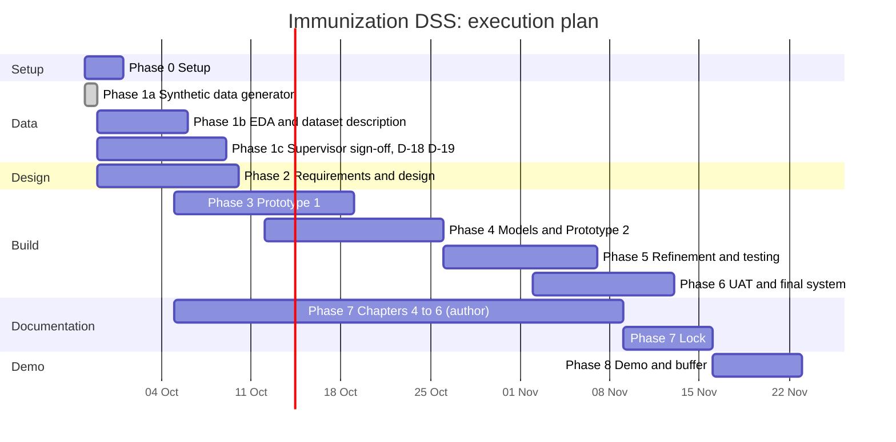

# 01. Master plan (start to end)

Anchor: work in this repo starts **Monday 2026-09-28**. The proposal Gantt places data collection and preparation in September, model training September to October, testing October to early November, and the demonstration in November 2026. The exact demo date is not in the documents (D-16). This plan assumes a demo in the week of **Nov 16 to 22** and compresses design and data work into parallel tracks to recover the gap against the Gantt (design was due to finish in September).

## 1. Approach

OOAD for analysis and design, evolutionary prototyping for development (proposal 3.2). The four proposal phases map onto build phases 3 to 6 below; phases 0 to 2 are the groundwork they depend on. Every prototype is a git tag.

| Proposal phase | This plan |
|---|---|
| 3.2.1 Initial requirements and first prototype | Phases 1, 2, 3 (tag `p1`) |
| 3.2.2 Evaluation and prototype development (analytics engine and priority algorithm integrated) | Phase 4 (tag `p2`) |
| 3.2.3 Iterative refinement cycles | Phase 5 (tag `p3`) |
| 3.2.4 Final system and deployment | Phase 6 (tag `v1.0`) |

## 2. Phases and gates

| Phase | Name | Dates | Objective | Gate (all must pass) |
|---|---|---|---|---|
| 0 | Setup | Sep 28 to 30 | SSH key and private GitHub repo, Python venv, PostgreSQL role and databases, repo skeleton (analytics package, Django project, React app), preflight checks | G0: `pytest` green on the skeleton; Django refuses to start on a missing or short secret (tested); `npm test` runs; first push to the author's own repo works; D-01 to D-08 confirmed or flagged |
| 1 | Synthetic data generation and EDA | Sep 28 to Oct 9 | 1a: seeded simulator calibrated to KDHS 2022 Table 11 (done 2026-09-28). 1b: EDA figures and dataset description. 1c: supervisor sign-off on the synthetic approach; decide D-18, D-19 | G1: `immdss validate-sim` passes all checks; generator tests green; same seed reproduces identical files; EDA figures in `docs/evidence`; D-02 confirmed with the supervisor |
| 2 | Requirements and design | Sep 29 to Oct 9 | FR and NFR from data profiling and desk review (proposal 3.3); use case, class, sequence (3), activity, architecture, ERD; wireframes | G2: requirement IDs frozen (or marked PROVISIONAL); all six proposal diagrams drafted in `docs/diagrams`; ERD matches the migrations plan; supervisor has seen the wireframes |
| 3 | Prototype 1 (p1) | Oct 5 to 18 | Data layer, auth and roles, facility scoping, the three module screens with basic data: stock display, simple defaulter list, child registration and history | G3: login to each dashboard works end to end on simulator data; endpoint x role tests green; automated walkthrough script runs and logs latency, query accuracy, ingestion errors (proposal 3.2.2 baseline); tag `p1` |
| 4 | Models and Prototype 2 (p2) | Oct 12 to 25 | Train and backtest baselines, SARIMA, GRU; stock-out alert logic; defaulter priority algorithm; integrate into dashboards via `run_forecasts` | G4: backtest table vs baselines logged; alert precision and recall reported vs ground truth; defaulter oracle tests pass exactly; forecasts visible in the inventory dashboard; tag `p2` |
| 5 | Refinement cycles and testing (p3) | Oct 26 to Nov 6 | Evaluation on edge cases and expanded data, fixes, security tests, performance (dashboard under 3 s), FHIR export validation, offline read cache (D-10) | G5: D-07 accuracy targets met or honestly reported; all test levels run and logged; no open critical or high defects; two consecutive cycles with no new critical issue (proposal 3.2.3); tag `p3` |
| 6 | UAT and final system | Nov 2 to 12 | UAT and SUS with real participants (D-12), final integration and performance runs, deployment on a clean machine | G6: UAT results collected and anonymised; final integration suite green; clean-clone install works; tag `v1.0` |
| 7 | Documentation | continuous; lock Nov 9 to 15 | Author writes Chapters 4 to 6 from the evidence; references fixed; Gantt updated | G7: chapter checklist in doc 06 ticked; every number traced to a log or test |
| 8 | Demonstration | Nov 16 to 22 | Demo script, reset command, rehearsal on a clean checkout, backup recording, panel practice | G8: demo runs from a fresh clone; backup recording exists |

## 3. Schedule

| Week | Dates | Focus |
|---|---|---|
| W1 | Sep 28 to Oct 4 | Setup; synthetic data generated and validated (done); EDA figures; design started |
| W2 | Oct 5 to 11 | Diagrams and requirements frozen; p1 build starts on the synthetic data |
| W3 | Oct 12 to 18 | p1 tagged; import cleaning measured; baselines and SARIMA backtests |
| W4 | Oct 19 to 25 | GRU, alert logic, defaulter priority, integration; p2 tagged |
| W5 | Oct 26 to Nov 1 | Refinement cycle 1; security and performance tests |
| W6 | Nov 2 to 8 | Refinement cycle 2; UAT sessions; p3 tagged |
| W7 | Nov 9 to 15 | Final system v1.0; chapters locked |
| W8 | Nov 16 to 22 | Demo, rehearsal, buffer |

**Critical path:** design and data model, then Prototype 1 on the synthetic data, then model training, then integration and evaluation. The data dependency is resolved: the dataset exists and regenerates in about a minute.

## 4. Who does what

| Actor | Responsibility |
|---|---|
| Author | Decisions, thesis prose, supervisor liaison, UAT with real participants, screenshots, understanding every file |
| Claude in this repo | Code, scripts, tests, cleaning pipeline, simulator, models, logs, evidence tables, outlines, reviews, defence notes, progress tracker updates; never fabricates data or results |
| Supervisor | Feedback on design and data approach; sign-off on decisions marked for supervisor |

## 5. Human checkpoints (stop and ask)

| When | Ask |
|---|---|
| End of Phase 0 | Confirm D-01 to D-08 |
| Before building on the data | Supervisor confirms the synthetic approach (D-02) and the assumptions list |
| Before schema migrations | Confirm the data model and roles |
| Before UAT | Confirm participants, consent, and ethics route (D-12) |
| Before feature freeze | Confirm nothing else is required by the supervisor |
| Any scope change | Log a decision and get approval |

## 6. Deliverables checklist

- [x] Calibrated, seeded synthetic data generator with manifest, ground truth and validation (2026-09-28)
- [ ] EDA and dataset description (Chapter 5.3 material)
- [ ] Import cleaning measured against the planted-defect answer key
- [ ] Design set: use case, class, sequence x3, activity, architecture, ERD, wireframes
- [ ] Working system with three modules, tagged p1, p2, p3, v1.0
- [ ] Model comparison and backtest report; alert and defaulter accuracy per D-07
- [ ] Test evidence: unit, integration, system, security, performance, UAT and SUS
- [ ] Chapters 4, 5, 6, references, appendices, updated Gantt
- [ ] Demo script and backup recording
- [ ] Logs: implementation, data cleaning, training, test, defence notes, AI assistance
