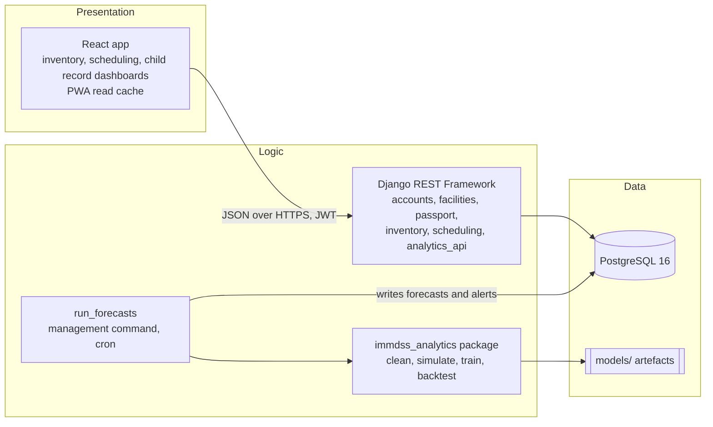

# 03. Architecture and data model

## 1. Three-tier architecture (proposal 3.8.4)



The analytics package never imports Django. `run_forecasts` reads history from PostgreSQL, calls the package, and writes `Forecast` and `StockAlert` rows. Dashboards only read.

## 2. Repository layout

```
analytics/                 immdss_analytics package (pyproject.toml), configs/, tests/
backend/                   Django project (config/), apps/, tests/
frontend/                  Vite + React, src/features/{inventory,scheduling,passport}
notebooks/                 EDA notebooks, outputs stripped
data/  models/             local only
```

## 3. Domain classes and data model (Phase 2 design, 2026-09-28)

Superseded sketch removed. The design is now:

| Artefact | File | Rendered |
|---|---|---|
| Class diagram (entities, value objects, services per Django app) | `docs/diagrams/F-CL_class.puml` | `docs/evidence/F-CL_class.{svg,png}` (landscape page) |
| ERD (crow's foot, keys) | generated from `docs/diagrams/schema.yaml` | `docs/evidence/F-ERD_entity_relationship.*` |
| Logical database schema (all columns and types) | generated from `schema.yaml` | `docs/evidence/F-LDS_logical_schema.*` |
| Data dictionary with CSV to table mapping | generated `docs/diagrams/data_dictionary.md` | n/a |

`schema.yaml` is the single source: 18 tables in six apps, one view (`stock_balance`). Phase 3 models are written from it, and a test compares the migrated schema with it. Key design choices: stock balance is derived from the ledger, never stored; `(child, dose)` is unique (BR-06); loaded synthetic rows keep their CSV identifier in `source_ref` and `is_synthetic = true`; lot `HISTORIC` maps to no lot; defaulters and dose statuses are computed by services, not stored; no table holds anything from `truth/`.

## 4. API outline (all under `/api/v1/`, JWT, facility-scoped)

| Resource | Methods | Roles |
|---|---|---|
| `auth/login`, `auth/refresh`, `auth/logout` | POST | all (login throttled) |
| `children/`, `children/{id}/`, `children/search` | GET, POST, PATCH | HCW, FM |
| `children/{id}/immunizations/` | GET, POST | HCW, FM |
| `children/{id}/fhir` | GET | HCW, FM |
| `stock/transactions/`, `stock/balance/` | GET, POST | HCW, FM |
| `forecasts/`, `alerts/` | GET | HCW, FM |
| `defaulters/` | GET | HCW, FM |
| `sessions/`, `sessions/{id}/plan`, `sessions/{id}/attendance` | GET, POST, PATCH | FM (plan), HCW (attendance) |
| `imports/` | POST (dry run, commit) | FM |
| `admin/users/`, `admin/facilities/`, `admin/schedule/` | CRUD | SA |

## 5. Security design

JWT access token (5 to 15 min) in memory, refresh token in HttpOnly Secure SameSite cookie with rotation and blacklist; login throttle and lockout; `FacilityScopedQuerysetMixin` on every viewset; default `IsAuthenticated` plus role permission classes; Argon2 hashing; preflight settings check refuses start on missing or short secrets; CORS allow-list; security headers middleware; audit log without sensitive field contents.
