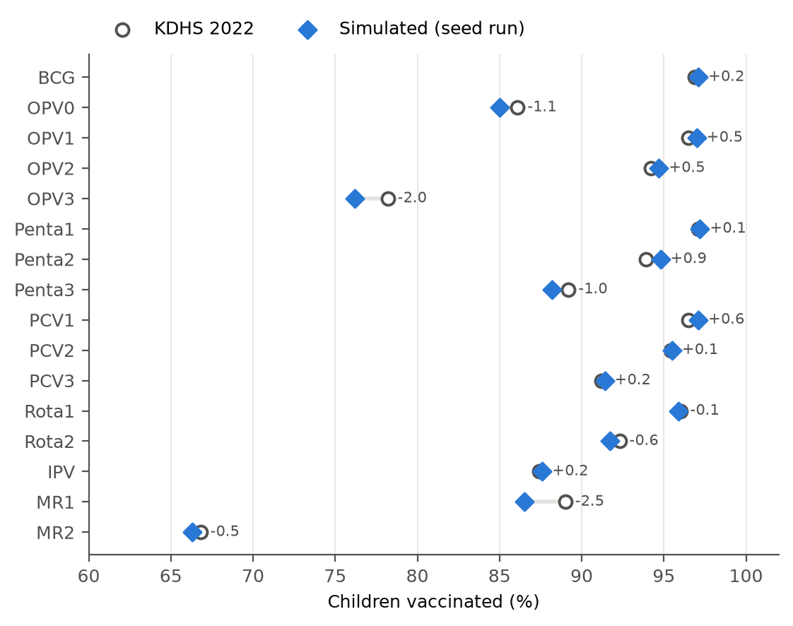
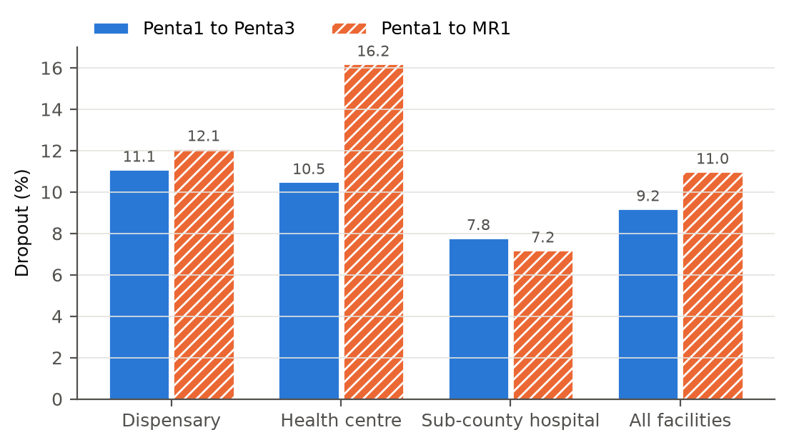
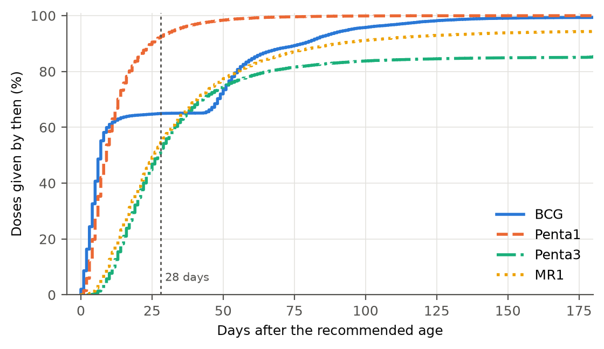
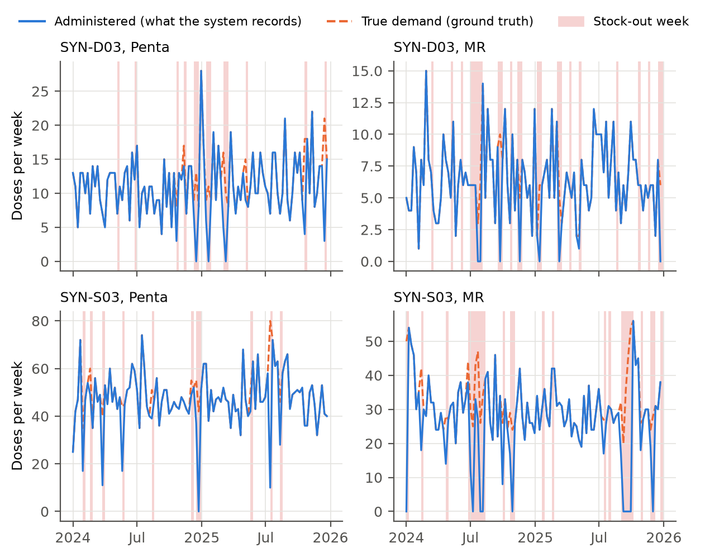
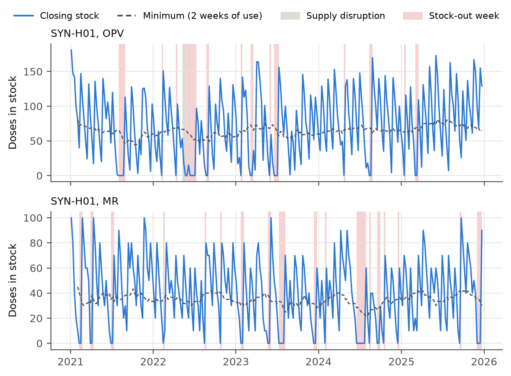
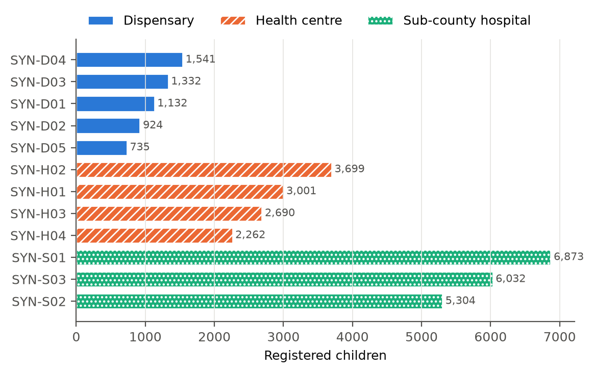
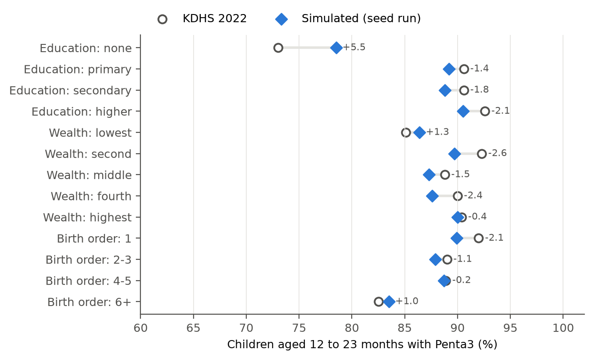

# EDA evidence: sim-seed42-368707d3

Generated 2026-09-28 by `immdss eda`. Run seed 42, config hash `368707d3`, git commit `uncommitted`. Validation: PASS. Each figure is followed by its data table (table alternative and evidence).

## T-5.1 Dataset description

| folder | file | rows | columns | column_names | content | use |
|---|---|---|---|---|---|---|
| app | antigens.csv | 7 | 4 | antigen_code, name, doses_per_vial, open_vial_policy | Vaccines, vial size, open-vial policy | Loaded by the application |
| app | children.csv | 35,525 | 10 | child_id, system_id, given_name, family_name, sex, date_of_birth, caregiver_name, registration_facility_code, registered_on, is_synthetic | Registered children (synthetic names, no phone numbers) | Loaded by the application |
| app | facilities.csv | 12 | 7 | facility_code, name, keph_level, ownership, county, sub_county, is_synthetic | Fictional facilities and their KEPH level | Loaded by the application |
| app | immunization_events.csv | 499,839 | 10 | event_id, child_id, dose_code, antigen_code, dose_number, given_on, facility_code, session_id, lot_number, is_synthetic | Doses given: child, dose, date, facility, session, lot | Loaded by the application |
| app | schedule.csv | 16 | 8 | dose_code, antigen_code, dose_number, contact, recommended_age_days, min_age_days, max_age_days, min_interval_days | KEPI dose rules: recommended, minimum and maximum age, minimum interval | Loaded by the application |
| app | sessions.csv | 17,724 | 5 | session_id, facility_code, date, kind, location_name | Fixed and outreach immunization sessions | Loaded by the application |
| app | stock_transactions.csv | 84,941 | 9 | transaction_id, date, facility_code, antigen_code, lot_number, kind, quantity_doses, session_id, is_synthetic | Stock ledger: opening balances, receipts, issues, wastage, losses | Loaded by the application |
| app | vaccine_lots.csv | 5,806 | 3 | lot_number, antigen_code, first_received | Vaccine lots and first receipt date | Loaded by the application |
| imports | import_dirty_truth.csv | 120 | 3 | file, row_index, defect | Answer key: row and defect type for every planted defect | Import-cleaning test only |
| imports | import_immunizations_dirty.csv | 617 | 6 | child_system_id, date_of_birth, dose_code, given_on, facility_code, lot_number | Immunization import sample with planted defects | Import-cleaning test only |
| imports | import_stock_dirty.csv | 200 | 6 | date, facility_code, antigen_code, lot_number, kind, quantity_doses | Stock import sample with planted defects | Import-cleaning test only |
| truth | children_truth.csv | 36,431 | 16 | child_id, home_facility_code, date_of_birth, sex, education, wealth, birth_order, residence, attends_outreach, risk_log_odds, entered_care, first_contact, dropout_after_contact, moved_to_facility_code, move_from_contact, registered | Every child born (including never-registered zero-dose children), background, dropout | Evaluation only, never loaded |
| truth | stockout_turned_away.csv | 20,005 | 4 | child_id, dose_code, date, facility_code | Every dose refused because of a stock-out | Evaluation only, never loaded |
| truth | weekly_stock.csv | 21,840 | 14 | facility_code, antigen_code, week_start, opening_doses, receipts_doses, requested_doses, administered_doses, unmet_doses, vials_opened, wastage_doses, loss_doses, in_disruption, closing_doses, stockout | Facility x antigen x week: true demand, administered, unmet, wastage, stock-out flag | Evaluation only, never loaded |

## F-D1

| indicator | cohort_size | simulated_pct | kdhs_2022_pct | difference_pp |
|---|---|---|---|---|
| BCG | 5309 | 97.1 | 96.9 | 0.2 |
| OPV0 | 5309 | 85.0 | 86.1 | -1.1 |
| OPV1 | 5309 | 97.0 | 96.5 | 0.5 |
| OPV2 | 5309 | 94.7 | 94.2 | 0.5 |
| OPV3 | 5309 | 76.2 | 78.2 | -2.0 |
| Penta1 | 5309 | 97.2 | 97.1 | 0.1 |
| Penta2 | 5309 | 94.8 | 93.9 | 0.9 |
| Penta3 | 5309 | 88.2 | 89.2 | -1.0 |
| PCV1 | 5309 | 97.1 | 96.5 | 0.6 |
| PCV2 | 5309 | 95.5 | 95.4 | 0.1 |
| PCV3 | 5309 | 91.4 | 91.2 | 0.2 |
| Rota1 | 5309 | 95.9 | 96.0 | -0.1 |
| Rota2 | 5309 | 91.7 | 92.3 | -0.6 |
| IPV | 5309 | 87.6 | 87.4 | 0.2 |
| MR1 | 5309 | 86.5 | 89.0 | -2.5 |
| MR2 | 5225 | 66.3 | 66.8 | -0.5 |
| Zero-dose | 5309 | 2.1 | 2.1 | 0.0 |

## F-D2

| facility_level | registered_12_23m | penta1 | penta3 | mr1 | dropout_penta1_penta3_pct | dropout_penta1_mr1_pct |
|---|---|---|---|---|---|---|
| Dispensary | 814 | 804 | 715 | 707 | 11.1 | 12.1 |
| Health centre | 1763 | 1752 | 1568 | 1468 | 10.5 | 16.2 |
| Sub-county hospital | 2621 | 2604 | 2400 | 2416 | 7.8 | 7.2 |
| All facilities | 5198 | 5160 | 4683 | 4591 | 9.2 | 11.0 |

## F-D3

| dose | doses_given | median_days_late | p75_days_late | p90_days_late | within_28_days_pct |
|---|---|---|---|---|---|
| BCG | 34916 | 7.0 | 51.0 | 78.0 | 65.0 |
| Penta1 | 34574 | 9.0 | 15.0 | 25.0 | 92.6 |
| Penta3 | 30200 | 27.0 | 51.0 | 192.0 | 52.5 |
| MR1 | 28245 | 26.0 | 47.0 | 90.0 | 54.6 |

## F-D4

| facility | antigen | weeks | stockout_weeks | requested_doses | administered_doses | unmet_doses |
|---|---|---|---|---|---|---|
| SYN-D03 | PENTA | 104 | 13 | 1225 | 1129 | 96 |
| SYN-D03 | MR | 104 | 24 | 687 | 645 | 42 |
| SYN-S03 | PENTA | 104 | 11 | 5109 | 4850 | 259 |
| SYN-S03 | MR | 104 | 26 | 3295 | 2792 | 503 |

## F-D5

| facility | antigen | weeks_below_minimum | stockout_weeks | disruption_weeks | median_closing_doses |
|---|---|---|---|---|---|
| SYN-H01 | OPV | 119 | 27 | 8 | 68.5 |
| SYN-H01 | MR | 109 | 35 | 6 | 40.0 |

## F-D6

| facility_code | name | keph_level | registered_children |
|---|---|---|---|
| SYN-D04 | Kasanga Dispensary | Dispensary | 1541 |
| SYN-D03 | Mugathi Dispensary | Dispensary | 1332 |
| SYN-D01 | Olomani Dispensary | Dispensary | 1132 |
| SYN-D02 | Chimani Dispensary | Dispensary | 924 |
| SYN-D05 | Gamani Dispensary | Dispensary | 735 |
| SYN-H02 | Semani Health Centre | Health centre | 3699 |
| SYN-H01 | Ndotamu Health Centre | Health centre | 3001 |
| SYN-H03 | Chinyeri Health Centre | Health centre | 2690 |
| SYN-H04 | Watamu Health Centre | Health centre | 2262 |
| SYN-S01 | Kirura Sub-County Hospital | Sub-county hospital | 6873 |
| SYN-S03 | Nyatamu Sub-County Hospital | Sub-county hospital | 6032 |
| SYN-S02 | Nyabiru Sub-County Hospital | Sub-county hospital | 5304 |

## F-D7

| file | defect | rows | share_of_file_pct |
|---|---|---|---|
| immunizations | DUPLICATE_ROW | 17 | 2.8 |
| immunizations | MALFORMED_DATE | 14 | 2.3 |
| immunizations | MISSING_CHILD_ID | 14 | 2.3 |
| immunizations | DATE_BEFORE_BIRTH | 13 | 2.1 |
| immunizations | UNKNOWN_DOSE | 13 | 2.1 |
| immunizations | UNKNOWN_FACILITY | 11 | 1.8 |
| immunizations | FUTURE_DATE | 8 | 1.3 |
| stock | NON_NUMERIC_QUANTITY | 11 | 5.5 |
| stock | UNKNOWN_ANTIGEN | 9 | 4.5 |
| stock | NEGATIVE_RECEIPT | 6 | 3.0 |
| stock | MALFORMED_DATE | 4 | 2.0 |

## F-D8

| group | category | n | simulated_penta3_pct | kdhs_2022_pct | difference_pp |
|---|---|---|---|---|---|
| education | none | 534 | 78.5 | 73.0 | 5.5 |
| education | primary | 1987 | 89.2 | 90.6 | -1.4 |
| education | secondary | 1866 | 88.8 | 90.6 | -1.8 |
| education | higher | 922 | 90.5 | 92.6 | -2.1 |
| wealth | lowest | 1235 | 86.4 | 85.1 | 1.3 |
| wealth | second | 989 | 89.7 | 92.3 | -2.6 |
| wealth | middle | 876 | 87.3 | 88.8 | -1.5 |
| wealth | fourth | 1010 | 87.6 | 90.0 | -2.4 |
| wealth | highest | 1199 | 90.0 | 90.4 | -0.4 |
| birth_order | 1 | 1648 | 89.9 | 92.0 | -2.1 |
| birth_order | 2-3 | 2038 | 87.9 | 89.0 | -1.1 |
| birth_order | 4-5 | 1058 | 88.7 | 88.9 | -0.2 |
| birth_order | 6+ | 565 | 83.5 | 82.5 | 1.0 |
